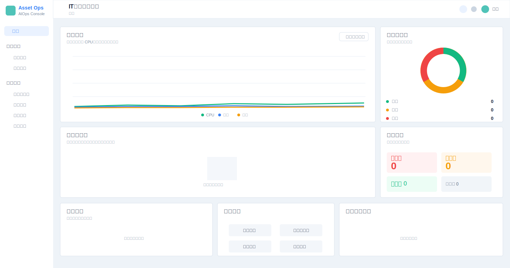

# IT设备管理平台

面向企业 IT 设备资产、Linux 服务器 SSH 纳管、运行监控和告警闭环的管理平台。项目基于 RuoYi 后端二次开发，当前默认前端为 `ruoyi-ui-vue3`。

## 当前能力

| 模块 | 说明 |
| --- | --- |
| 首页工作台 | 展示资产、服务器、在线率、告警、资源趋势和风险服务器概览 |
| 资产中心 | 设备资产入库、资产变更、服务器类资产纳入监控 |
| 监控中心 | 服务器 SSH 连接配置、连接测试、立即采集、监控数据、告警事件和告警规则 |
| 远程运维 | 基于预设命令查看磁盘、内存、负载、进程和监听端口 |
| 平台能力 | 登录、动态菜单、权限按钮、个人中心、明暗主题 |

## 系统预览



## 技术栈

| 层级 | 技术 |
| --- | --- |
| 后端 | Java 17、Spring Boot 3.4.5、RuoYi、Spring Security、MyBatis、Quartz、sshj |
| 数据 | MySQL 8、Redis 7、Druid |
| 前端 | Vue3、Vite、Element Plus、Pinia、Vue Router 4、Axios、ECharts |
| 部署 | Docker Compose、Nginx、MySQL、Redis |

## 项目结构

```text
asset-management/
├── ruoyi-admin/          # 后端启动模块和 Web 控制器
├── ruoyi-common/         # 通用工具、注解、常量和基础实体
├── ruoyi-framework/      # 安全认证、数据权限、Web 配置
├── ruoyi-generator/      # RuoYi 代码生成模块
├── ruoyi-quartz/         # 定时任务模块
├── ruoyi-system/         # 系统、资产、监控业务模块
├── ruoyi-ui-vue3/        # 默认 Vue3 + Vite 前端
├── sql/                  # 数据库初始化脚本
├── docker/               # Nginx、MySQL、Redis 运行配置
├── docker-compose.yml    # Docker Compose 编排
├── Dockerfile.backend    # 后端镜像构建
├── Dockerfile.frontend   # Vue3 前端镜像构建
└── README.md
```

## Docker 部署

### 环境要求

部署前需要先安装：

| 工具 | 建议版本 |
| --- | --- |
| Docker | 20.10+ |
| Docker Compose | v2+ |

确认 Docker 可用：

```bash
docker --version
docker compose version
```

### 1. 准备环境变量

```bash
cp .env.example .env
```

修改 `.env` 中的数据库密码、Token 密钥、Druid 账号密码和 `SSH_CREDENTIAL_KEY`。

`SSH_CREDENTIAL_KEY` 用于加密服务器 SSH 密码。生产环境必须使用足够长的随机值，并且不要提交到 Git。

示例：

```env
MYSQL_ROOT_PASSWORD=change-me
TOKEN_SECRET=change-me-to-a-long-random-string
DRUID_LOGIN_USERNAME=ruoyi
DRUID_LOGIN_PASSWORD=change-me
SSH_CREDENTIAL_KEY=change-me-to-another-long-random-string

BACKEND_PORT=8080
FRONTEND_PORT=80
MYSQL_PORT=3306
REDIS_PORT=6379
```

### 2. 构建并启动

```bash
docker compose up -d --build

```

默认初始化账号：

```text
前端：http://localhost
后端：http://localhost:8080
用户名：admin
密码：admin123
```

